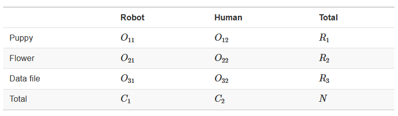
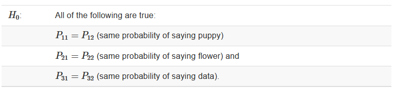

## Last Time

-   Review hypothesis testing

-   Conduct and interpret power analyses

```{r, results = 'hide', message = F, warning = F}
library(here)
library(tidyverse)
library(psych)
library(psychTools)
library(knitr)
library(kableExtra)
library(ggpubr)
library(patchwork)

set.seed(42)
```

------------------------------------------------------------------------

## Today...

-   The chi-square goodness-of-fit test

-   The chi-square test of independence ([Book Chapter 12.2](https://learningstatisticswithr.com/book/chisquare.html#chisqindependence))

-   Review Assumptions of chi-square test

    ------------------------------------------------------------------------

## Pop Quiz...jk {.center}

-   What do we mean when we say a study was powered to an effect of 0.34?

-   What does a p-value tell us?

    -   [Scientists get it wrong](https://fivethirtyeight.com/features/not-even-scientists-can-easily-explain-p-values/)

------------------------------------------------------------------------

### Reminders

p-values = the probability of getting that score or higher *if the null hypothesis was true*

-   Power = the probability of correctly rejecting the null when the null is false

-   **Categorical Data!**

    ------------------------------------------------------------------------

    ## What are the steps of NHST?

::::: columns
::: {.column width="50%"}
1.  Define null and alternative hypothesis.

2.  Set and justify alpha level.

3.  Determine which sampling distribution ( $z$, $t$, or $\chi^2$ for now)

4.  Calculate parameters of your sampling distribution under the null.

-   If $z$, calculate $\mu$ and $\sigma_M$
:::

::: {.column width="50%"}
5.  Calculate test statistic under the null.

-   If $z$, $\frac{\bar{X} - \mu}{\sigma_M}$

6.  Calculate probability of that test statistic or more extreme under the null, and compare to alpha.
:::
:::::

------------------------------------------------------------------------

One-sample tests compare your given sample with a "known" population.

Research question: does this sample come from this population?

**Hypotheses**

-   $H_0$: Yes, this sample comes from this population.

-   $H_1$: No, this sample comes from a different population.

------------------------------------------------------------------------

## Example - Coffee Shop

Let's say we collect data on customers of a coffee shop and we want to see if there is an **equal number of folks** that come into the shop across all days. Therefore, we record how many individuals came into the coffee shop over a weeks time.

***How would we test this?***

-   First, setup the Null and alternative:

    -   $H_0$: Customers will be equal across all days.

    -   $H_1$: There will be more customers on one or multiple days than others and will not be equal

------------------------------------------------------------------------

### Example - Distribution

```{r}
#| code-fold: true 
#| 
days <- c("M", "T", "W", "R", "F")
expected <- rep(50, length(days)) 
df <- data.frame(days, expected) 
order <- c("M", "T", "W", "R", "F")  
unif <- df %>%    
  ggplot(aes(x = days, y = expected)) +    
  geom_col() +    
  scale_x_discrete(limits = order) +    
  labs(title = "Uniform - Null") +    
  ylim(0, 65)  

observed <- round(rnorm(5, mean = 55, sd = 4), 2) 
df2 <- data.frame(days, observed)  
rand <- df %>%    
  ggplot(aes(x = days, y = observed)) +    
  geom_col() +    
  scale_x_discrete(limits = order) +    
  labs(title = "Alternative") +    
  ylim(0, 65)  

(unif + rand)
```

------------------------------------------------------------------------

### Example - Set Alpha

After determining the Null and Alternative Hypotheses, we set our Alpha level.

Let's keep things simple and keep it at convention to set it for $\alpha$ = 0.05

------------------------------------------------------------------------

### Example - Distribution

Now we determine the type of distribution that we will be working with

In the past we have used:

-   Normal Distribution ( $z$-scores )

-   t-distribution ( $t$-scores )

------------------------------------------------------------------------

Now we are going to be using a distribution that works with ***categorical (nominal)*** **data**.

**The** $\chi^2$ **- distribution**

::: nonincremental
-   We use this distribution because we are dealing with (1) one sample, and (2) a categorical outcome

-   **Note**: this test will provide statistical evidence of an association or relationship between two categorical variables
:::

***???*** The way you measure the variable determines whether it is categorical or continuous. We can create summary statistics from categorical variables by counting or calculating proportions -- but that makes the summary statistics continuous, *not the outcome variable itself*.

------------------------------------------------------------------------

## Distribution - Degrees of freedom

The $\chi^2$ distribution is a single-parameter distribution defined by it's degrees of freedom.

In the case of a **goodness-of-fit test** (like this one), the degrees of freedom are $\textbf{k-1}$, where k is the number of groups.

------------------------------------------------------------------------

## Degrees of freedom

The **Degrees of freedom** are the number of genuinely independent things in a calculation. It's specifically calculated as the number of quantities in a calculation minus the number of constraints.

What it means in principle is that given a set number of categories (k) and a constraint (the proportions have to add up to 1), I can freely choose numbers for k-1 categories. But for the kth category, there's only one number that will work.

------------------------------------------------------------------------

::::: columns
::: {.column width="30%"}
[The degrees of freedom are the number of categories (k) minus 1. Given that the category frequencies must sum to the total sample size, k-1 category frequencies are free to vary; the last is determined.]{style="font-size:30px;"}
:::

::: {.column width="70%"}
```{r}
(critical_val = qchisq(p = 0.95, df = 5-1))
```

```{r}
#| code-fold: true 
#| 
data.frame(x = seq(0,20)) %>%   
  ggplot(aes(x = x)) +   
  stat_function(fun = function(x) 
    dchisq(x, df = 5-1), geom = "line") +   
  stat_function(fun = function(x) 
    dchisq(x, df = 5-1), geom = "area", fill = "purple",
                xlim =c(critical_val, 20)) +   
  geom_vline(aes(xintercept = critical_val), linetype = 2, color = "purple")+   
  geom_text(aes(x = critical_val+2, 
                y = dchisq(critical_val, 5-1) + .05,
                label = paste("Critical Value =",
                              round (critical_val,2))),
            angle = 90)+   
  labs(x = "Chi-Square", y = "Density", title = "Area under the curve") +   
  theme_pubr(base_size = 20)
```
:::
:::::

------------------------------------------------------------------------

### Calculating the $\chi^2$ test statistic

Let's first take a look at the observed data that we have as well as the expected data under the Null

```{r}
observed <- df2 
expected <- df
```

|  |  |  |  |  |  |  |
|-----------|-----------|-----------|-----------|-----------|-----------|-----------|
|  |  | **Monday** | **Tuesday** | **Wednesday** | **Thursday** | **Friday** |
| **Observed** | $O_i$ | `r observed[1,2]` | `r observed[2,2]` | `r observed[3,2]` | `r observed[4,2]` | `r observed[5,2]` |
| **Expected** | $E_i$ | `r expected[1,2]` | `r expected[2,2]` | `r expected[3,2]` | `r expected[4,2]` | `r expected[5,2]` |

Now what? We need some way to index differences between these frequencies so that we can sensibly determine how rare or unusual the observed data are compared to the null distribution.

------------------------------------------------------------------------

$$\chi^2_{df = k-1} = \sum^k_{i=1}\frac{(O_i-E_i)^2}{E_i}$$

The chi-square goodness of fit (GOF) statistic compares observed and expected frequencies. It is small when the observed frequencies closely match the expected frequencies under the null hypothesis. The chi-square distribution can be used to determine the particular $\chi^2$ value that corresponds to a rare or unusual profile of observed frequencies.

------------------------------------------------------------------------

|  |  |  |  |  |  |  |
|-----------|-----------|-----------|-----------|-----------|-----------|-----------|
|  |  | **Monday** | **Tuesday** | **Wednesday** | **Thursday** | **Friday** |
| **Observed** | $O_i$ | `r observed[1,2]` | `r observed[2,2]` | `r observed[3,2]` | `r observed[4,2]` | `r observed[5,2]` |
| **Expected** | $E_i$ | `r expected[1,2]` | `r expected[2,2]` | `r expected[3,2]` | `r expected[4,2]` | `r expected[5,2]` |
| **Difference** | $O_i - E_i$ | `r observed[1,2] - expected[1,2]` | `r observed[2,2] - expected[2,2]` | `r observed[3,2] - expected[3,2]` | `r observed[4,2] - expected[4,2]` | `r observed[5,2] - expected[5,2]` |

------------------------------------------------------------------------

```{r, results = 'asis', message=F}
#| code-fold: true 

chisq_tab <- full_join(expected, observed) %>%    
  mutate(diff = (observed - expected)) 

chisq_tab %>%    
  kable(., format = "html", digits = 2,          
        align = c("c", "c", "c", "c"),          
        col.names = c("Days", "Expected", "Observed", "Difference")) 
```

------------------------------------------------------------------------

We now have the differences between the expected and observed, but there are likely going to be some negative numbers. To fix this, we can square the differences

```{r, results = 'asis', message=F}
#| code-fold: true 

chisq_tab %>%    
  mutate(sq_diff=(diff^2)) %>%    
  kable(., format = "html", digits = 2,          
        align = c("c", "c", "c", "c", "c"),          
        col.names = c("Days", "Expected", "Observed", "Difference", "Sq. Diff"))
```

------------------------------------------------------------------------

::::: columns
::: {.column width="50%"}
Now we have a collection of numbers that are large whenever the null hypothesis makes a bad prediction and small when it makes a good prediction.

Next, we need to divide all numbers by the expected frequency as a way to put our estimate into perspective
:::

::: {.column width="50%"}
```{r, results = 'asis', message=F}
#| code-fold: true 

chisq_tab <- chisq_tab %>%    
  mutate(sq_diff=(diff^2)) %>%   
  mutate(error = sq_diff/50)   

chisq_tab %>%    
  kable(., format = "html", digits = 2,          
        align = c("c", "c", "c", "c", "c", "c"),
        col.names = c("Days", "Expected", "Observed", "Difference", "Sq. Diff", "Error Score")) 
```
:::
:::::

------------------------------------------------------------------------

We can finish this off by taking each of our scores related to "error" and adding them up

The result is the **goodness of fit** statistic (GOF) or $\chi^2$

::::: columns
::: {.column width="50%"}
```{r}
chi_square <- sum(chisq_tab$error) 
chi_square
```

Let's compare that to the critical $\chi^2$ value given the df of the sample

```{r}
critical_val <- qchisq(p = 0.95, 
                       df = length(chisq_tab$days)-1) 

critical_val
```
:::

::: {.column width="50%"}
Calculate the probability of getting our sample statistic or greater ***if the null were true***

```{r}
p_val <- pchisq(q = chi_square, 
                df = length(chisq_tab$days)-1, 
                lower.tail = F) 

p_val
```

**What can we conclude?**
:::
:::::

------------------------------------------------------------------------

::::: columns
::: {.column width="30%"}
[The degrees of freedom are the number of categories (k) minus 1. Given that the category frequencies must sum to the total sample size, k-1 category frequencies are free to vary; the last is determined.]{style="font-size:30px;"}
:::

::: {.column width="70%"}
```{r warning=FALSE, message=FALSE}
#| code-fold: true 
#|
data.frame(x = seq(0,20)) %>%   
  ggplot(aes(x = x)) +   
  stat_function(fun = function(x) dchisq(x, 
                                      df = length(chisq_tab$days)-1), geom = "line") +   
  stat_function(fun = function(x) dchisq(x, 
                                         df = length(chisq_tab$days)-1), 
                geom = "area", fill = "purple",                  xlim =c(critical_val, 20)) +   
  geom_vline(aes(xintercept = critical_val), linetype = 2, color = "purple")+     
  geom_vline(aes(xintercept = chi_square), linetype = 2, color = "black")+   
  geom_text(aes(x = critical_val+2, y = dchisq(critical_val, length(chisq_tab$days)-1) + .05,                  label = paste("Critical Value =", round (critical_val,2))), angle = 90)+     
  geom_text(aes(x = chi_square+2, y = dchisq(critical_val, length(chisq_tab$days)-1) + .05,                  
                label = paste("Test statistic =", round (chi_square,2))), angle = 90)+  
  labs(x = "Chi-Square", y = "Density", title = "Area under the curve") +
  theme_pubr(base_size = 20)
```
:::
:::::

------------------------------------------------------------------------

::::: columns
::: {.column width="30%"}
[The degrees of freedom are the number of categories (k) minus 1. Given that the category frequencies must sum to the total sample size, k-1 category frequencies are free to vary; the last is determined.]{style="font-size:30px;"}
:::

::: {.column width="70%"}
```{r warning=FALSE, message=FALSE}
#| code-fold: true 

data.frame(x = seq(0,20)) %>%   
  ggplot(aes(x = x)) +   
  stat_function(fun = function(x) dchisq(x, df = length(chisq_tab$days)-1), geom = "line") +   
  stat_function(fun = function(x) dchisq(x, df = length(chisq_tab$days)-1), geom = "area", fill = "purple",                  xlim =c(chi_square, 20)) +   
  geom_vline(aes(xintercept = critical_val), linetype = 2, color = "black")+   
  geom_vline(aes(xintercept = chi_square), linetype = 2, color = "purple")+   geom_text(aes(x = critical_val+2, y = dchisq(critical_val, length(chisq_tab$days)-1) + .05,                  label = paste("Critical Value =", round (critical_val,2))), angle = 90)+   
  geom_text(aes(x = chi_square+2, y = dchisq(critical_val, length(chisq_tab$days)-1) + .05,
                label = paste("Test statistic =", round (chi_square,2))), angle = 90)+   labs(x = "Chi-Square", y = "Density", title = "Area under the curve") +
  theme_pubr(base_size = 20)
```
:::
:::::

------------------------------------------------------------------------

### Recap of the Steps

1.  Define null and alternative hypothesis.

-   $H_0$: No difference across days

-   $H_1$: Days will be different

2.  Set and justify alpha level $\alpha$ = 0.05

3.  Determine which sampling distribution ( $\chi^2$ )

4.  Calculate parameters of your sampling distribution under the null.

-   Calculate $\chi^2$-critical: `r critical_val`

### Recap of the Steps (con't.)

5.  Calculate test statistic under the null.

-   $\chi^2_{df = k-1} = \sum^k_{i=1}\frac{(O_i-E_i)^2}{E_i}$
-   `r chi_square`

6.  Calculate probability of that test statistic or more extreme under the null, and compare to alpha.

    ```{r}
    pchisq(q = chi_square, 
           df = length(chisq_tab$days)-1, 
           lower.tail = F)
    ```

------------------------------------------------------------------------

Now that we know how to do the test using R, we now need to be able to ***write up the analyses*** that we just performed.

If we wanted to write these results from our example into a paper or something similar (maybe telling our pet who prefers scientific writing), we could do this:

> Across all days of the average workweek, we observed, `r observed[1,2]` patrons on Monday, `r observed[2,2]` customers on Tuesday, `r observed[3,2]` on Wednesday, `r observed[4,2]` for Thursday, and finally `r observed[5,2]` patrons on Friday. A chi-square goodness of fit test was conducted to test whether these data followed a uniform distribution with 50 visits per day. The results of the test ( $\chi^2$(4) = `r round(chi_square, 2)`, $p$ = `r round(p_val, 2)`) indicate no differences from the uniform distribution.

------------------------------------------------------------------------

> Across all days of the average workweek, we observed, `r observed[1,2]` patrons on Monday, `r observed[2,2]` customers on Tuesday, `r observed[3,2]` on Wednesday, `r observed[4,2]` for Thursday, and finally `r observed[5,2]` patrons on Friday. A chi-square goodness of fit test was conducted to test whether these data followed a uniform distribution with 50 visits per day. The results of the test ( $\chi^2$(4) = `r round(chi_square, 2)`, $p$ = `r round(p_val, 2)`) indicate no differences from the uniform distribution.

A couple things to notice about the write up:

::::: columns
::: {.column width="50%"}
1.  Before the test, there are some descriptives

2.  Informs you of the null hypothesis
:::

::: {.column width="50%"}
3.  Inclusion of a "stats block"
4.  Results are interpreted
:::
:::::

## But what if...

In the example, we had a null distribution that was distributed uniformly

What if that isn't a super interesting research question?

Instead we may want to compare the proportions in our sample to a larger population

## Example 2 - Schools & Super-powers

The data were obtained from [Census at School](https://ww2.amstat.org/censusatschool/), a website developed by the American Statistical Association tohelp students in the 4th through 12th grades understand statistical problem-solving.

::: nonincremental
-   The site sponsors a survey that students can complete and a database that students and instructors can use to illustrate principles in quantitative methods.

-   The database includes students from all 50 states, from grade levels 4 through 12, both boys and girls, who have completed the survey dating back to 2010.
:::

------------------------------------------------------------------------

Let's focus on a single question:

*Which of the following superpowers would you most like to have? Select one.*

:::::: nonincremental
::::: columns
::: {.column width="50%"}
-   Invisibility
-   Telepathy (read minds)
-   Freeze time
:::

::: {.column width="50%"}
-   Super strength
-   Fly
:::
:::::
::::::

The responses from 250 randomly selected New York students were obtained from the Census at School database.

```{r, message=FALSE, warning = F}
school <- read_csv("https://raw.githubusercontent.com/dharaden/dharaden.github.io/main/data/example2-chisq.csv")  
school <- school %>%    
  filter(!is.na(Superpower))
```

------------------------------------------------------------------------

::::: columns
::: {.column width="50%"}
```{r frequency table, results = 'asis'}
#| code-fold: true 

school %>%   
  group_by(Superpower) %>%   
  summarize(Frequency = n()) %>%   
  mutate(Proportion = Frequency/sum(Frequency)) %>%
  kable(.,          
        format = "html",
        digits = 2) %>%    
  kable_classic(font_size = 25)
```
:::

::: {.column width="50%"}
Descriptively this is interesting. But, are the responses unusual or atypical in any way? To answer that question, we need some basis for comparison---a null hypothesis <br> One option would be to ask if the New York preferences are different compared to students from the general population.
:::
:::::

------------------------------------------------------------------------

```{r, message=FALSE, warning = F}
#| code-fold: true 

school_usa <-  read_csv("https://raw.githubusercontent.com/uopsych/psy611/master/data/census_at_school_usa.csv")  
school_usa$Region = "USA" 

school %>%   
  full_join(select(school_usa, Region, Superpower)) %>%   
  filter(!is.na(Superpower)) %>%   
  group_by(Region, Superpower) %>%   
  summarize(Frequency = n()) %>%   
  mutate(Proportion = Frequency/sum(Frequency)) %>%   
  ggplot(aes(x = Region, y = Proportion, fill = Region)) +
    geom_bar(stat = "identity", position = "dodge") +   
    coord_flip() +   
    labs(x = NULL,     
         title = "Category Proportion as a function of Source") +
    guides(fill = "none") +   
    facet_wrap(~Superpower) +   
    theme_bw(base_size = 20) +    
    theme(plot.title.position = "plot")
```

------------------------------------------------------------------------

::::: columns
::: {.column width="50%"}
$H_0$: New York student superpower preferences are similar to the preferences of typical students in the United States.

$H_1$: New York student superpower preferences are different from the preferences of typical students in the United States.
:::

::: {.column width="50%"}
```{r, results = 'asis', message=F}
#| code-fold: true 

school %>%
  full_join(select(school_usa, Region, Superpower)) %>% 
  mutate(Region = ifelse(Region == "NY", "NY", "USA")) %>%
  filter(!is.na(Superpower)) %>%   
  group_by(Region, Superpower) %>%  
  summarize(Frequency = n()) %>% 
  mutate(Proportion = Frequency/sum(Frequency)) %>%  
  select(-Frequency) %>%   
  spread(Region, Proportion) %>% 
  kable(.,         
        col.names = c("Superpower", 
                      "NY Observed\nProportion", 
                      "USA\nProportion"),  
        format = "html",         
        digits = 2)%>%    
  kable_classic(font_size = 25)
```
:::
:::::

------------------------------------------------------------------------

### Calculating the $\chi^2$ test statistic

To compare the New York observed frequencies to the US data, we need to calculate the frequencies that would have been expected if New York was just like all of the other states.

The expected frequencies under this null model can be obtained by taking each preference category proportion from the US data (the null expectation) and multiplying it by the sample size for New York:

$$E_i = P_iN_{NY}$$

------------------------------------------------------------------------

```{r, echo = F}
usa_freq = table(school_usa$Superpower) 
usa_prop = usa_freq/sum(usa_freq)  

school %>%   
  filter(!is.na(Superpower)) %>%  
  group_by(Superpower) %>% 
  summarize(Frequency = n()) %>% 
  mutate(Expected = usa_prop*200, 
         Expected = round(Expected, 2)) %>%  
  kable(., format = "html", digits = 2, align = c("l", "c", "c"),         col.names = c("Superpower", "Observed\nFreq", "Expected Freq"))
```

Now what? We need some way to index differences between these frequencies, preferably one that translates easily into a sampling distribution so that we can sensibly determine how rare or unusual the New York data are compared to the US (null) distribution.

------------------------------------------------------------------------

$$\chi^2_{df = k-1} = \sum^k_{i=1}\frac{(O_i-E_i)^2}{E_i}$$

The chi-square goodness of fit (GOF) statistic compares observed and expected frequencies. It is small when the observed frequencies closely match the expected frequencies under the null hypothesis. The chi-square distribution can be used to determine the particular $\chi^2$ value that corresponds to a rare or unusual profile of observed frequencies.

------------------------------------------------------------------------

```{r create obs, echo = 3:4}

ny_observed = table(school$Superpower)
ny_expected = (table(school_usa$Superpower)/sum(table(school_usa$Superpower)))*200 
ny_observed 
ny_expected
```

------------------------------------------------------------------------

```{r, ref.label="create obs", echo=3:4}
```

```{r}
(chi_square = sum((ny_observed - ny_expected)^2/ny_expected))
```

------------------------------------------------------------------------

```{r, ref.label="create obs", echo=3:4}
```

```{r, highlight=2}
(chi_square = sum((ny_observed - ny_expected)^2/ny_expected)) 
(critical_val = qchisq(p = 0.95, df = length(ny_expected)-1))
```

------------------------------------------------------------------------

```{r, ref.label="create obs", echo=3:4}
```

```{r, highlight=2}
(chi_square = sum((ny_observed - ny_expected)^2/ny_expected)) 
(critical_val = qchisq(p = 0.95, df = length(ny_expected)-1)) 
(p_val = pchisq(q = chi_square, df = length(ny_expected)-1, lower.tail = F))
```

------------------------------------------------------------------------

::::: columns
::: {.column width="30%"}
[The degrees of freedom are the number of categories (k) minus 1. Given that the category frequencies must sum to the total sample size, k-1 category frequencies are free to vary; the last is determined.]{style="font-size:30px;"}
:::

::: {.column width="70%"}
```{r}
#| code-fold: true 
#|   
data.frame(x = seq(0,20)) %>%   
  ggplot(aes(x = x)) +   
  stat_function(fun = function(x) dchisq(x, df = length(ny_expected)-1), geom = "line") + 
  stat_function(fun = function(x) dchisq(x, df = length(ny_expected)-1), geom = "area", fill = "purple",                  xlim =c(critical_val, 20)) + 
  geom_vline(aes(xintercept = critical_val), linetype = 2, color = "purple")+    
  geom_vline(aes(xintercept = chi_square), linetype = 2, color = "black")+  
  geom_text(aes(x = critical_val+2, y = dchisq(critical_val, length(ny_expected)-1) + .05,                  label = paste("Critical Value =", round (critical_val,2))), angle = 90)+    
  geom_text(aes(x = chi_square+2, y = dchisq(critical_val, length(ny_expected)-1) + .05,
                label = paste("Test statistic =", round (chi_square,2))), angle = 90)+ 
  labs(x = "Chi-Square", y = "Density", title = "Area under the curve") +  
  theme_pubr(base_size = 20)
```
:::
:::::

------------------------------------------------------------------------

::::: columns
::: {.column width="30%"}
[The degrees of freedom are the number of categories (k) minus 1. Given that the category frequencies must sum to the total sample size, k-1 category frequencies are free to vary; the last is determined.]{style="font-size:30px;"}
:::

::: {.column width="70%"}
```{r}
#| code-fold: true 

data.frame(x = seq(0,20)) %>% 
  ggplot(aes(x = x)) +   stat_function(fun = function(x) dchisq(x, df = length(ny_expected)-1), geom = "line") +   stat_function(fun = function(x) dchisq(x, df = length(ny_expected)-1), geom = "area", fill = "purple",                  xlim =c(chi_square, 20)) + 
  geom_vline(aes(xintercept = critical_val), linetype = 2, color = "black")+ 
  geom_vline(aes(xintercept = chi_square), linetype = 2, color = "purple")+  
  geom_text(aes(x = critical_val+2, y = dchisq(critical_val, length(ny_expected)-1) + .05,                  label = paste("Critical Value =", round (critical_val,2))), angle = 90)+ 
  geom_text(aes(x = chi_square+2, y = dchisq(critical_val, length(ny_expected)-1) + .05,
                label = paste("Test statistic =", round (chi_square,2))), angle = 90)+ 
  labs(x = "Chi-Square", y = "Density", title = "Area under the curve") + 
  theme_pubr(base_size = 20)
```
:::
:::::

------------------------------------------------------------------------

```{r}
p.usa = (table(school_usa$Superpower)/sum(table(school_usa$Superpower))) 
p.usa 
chisq.test(x = ny_observed, p = p.usa)
```

The New York student preferences are unusual under the null hypothesis (USA preferences).

Note that the `chisq.test` function takes for x a vector of the counts. In other words, to use this function, you need to calculate the summary statisttic of counts and feed that into the function.

------------------------------------------------------------------------

```{r}
c.test = chisq.test(x = ny_observed, p = p.usa) 
str(c.test)
```

------------------------------------------------------------------------

```{r}
c.test$residuals
```

------------------------------------------------------------------------

```{r, echo = 2}
p.usa = as.data.frame(p.usa)[,"Freq"] 

lsr::goodnessOfFitTest(x = as.factor(school$Superpower), 
                       p = p.usa)
```

(Note that this function, `goodnessOfFitTest`, takes the raw data, not the vector of counts.)

------------------------------------------------------------------------

What if we had used the equal proportions null hypothesis?

```{r}
lsr::goodnessOfFitTest(x = as.factor(school$Superpower))
```

Why might this be a sensible or useful test?

## The usefulness of $\chi^2$

How often will you conducted a $chi^2$ goodness of fit test on raw data?

-   (Probably) never

How often will you come across $\chi^2$ tests?

-   (Probably) a lot!

The goodness of fit test is used to statistically test the how well a model fits data.

------------------------------------------------------------------------

## Model Fit with $\chi^2$

To calculate Goodness of Fit of a model to data, you build a statistical model of the process as you believe it is in the world.

::: nonincremental
-   example: depression \~ age + parental history of depression
:::

-   Then you estimate each subject's predicted/expected value based on your model.

-   You compare each subject's predicted value to their actual value -- the difference is called the **residual** ( $\varepsilon$ ).

------------------------------------------------------------------------

If your model is a good fit, then

$$\Sigma_1^N\varepsilon^2 = \chi^2$$

-   We would then compare that to the distribution of the Null: $\chi^2_{N-p}$ .

-   Significant chi-square tests suggest the model does not fit -- the data have values that are far away from "expected."

------------------------------------------------------------------------

# $\chi^2$ test of independence or association

------------------------------------------------------------------------

## $\chi^2$ test of independence or association

The previous tests that we conducted last class, we were focused on the way our data (NY Students Superpower Preferences) "fit" to the data of an expected distribution (US Student Superpower Preferences)

Although this could be interesting, sometimes we have two categorical variables that we want to compare to one another

-   How do types of traffic stops differ by the gender identity of the police officer?

------------------------------------------------------------------------

Let's take a look at a scenario:

We are part of a delivery company called Planet Express

{fig-align="center"}

------------------------------------------------------------------------

Let's take a look at a scenario:

We are part of a delivery company called Planet Express

We have been tasked to deliver a package to Chapek 9

{fig-align="center"}

------------------------------------------------------------------------

Let's take a look at a scenario:

We are part of a delivery company called Planet Express

We have been tasked to deliver a package to Chapek 9

Unfortunately, the planet is inhabited completely by robots and humans are not allowed

In order to deliver the package, we have to go through the guard gate and prove that we are able to gain access

------------------------------------------------------------------------

### At the guard gate

> *(Robot Voice)*
>
> WHICH OF THE FOLLOWING WOULD YOU MOST PREFER?
>
> A: A Puppy
>
> B: A pretty flower from your sweetie
>
> C: A large properly-formatted data file
>
> CHOOSE NOW!

-   Clearly an ingenious test that will catch any imposters!
-   ***But what if humans and robots have similar preferences?***

------------------------------------------------------------------------

Luckily, I have connections with Chapek 9 and we can see if there are any similarities between the responses.

Let's work through how to do a $\chi^2$ test of independence (or association)

First, we have to load in the data:

```{r}
chapek9 <- read.csv("https://raw.githubusercontent.com/dharaden/dharaden.github.io/main/data/chapek9.csv") %>%    
  mutate(choice = as.factor(choice),           
         species = as.factor(species))
```

------------------------------------------------------------------------

## Chapek 9 Data

Take a peek at the data:

```{r}
head(chapek9) 
# or  
#glimpse(chapek9)
```

------------------------------------------------------------------------

### Chapek 9 Data

Look at the summary stats for the data:

```{r}
summary(chapek9) 
```

------------------------------------------------------------------------

### Chapek 9 Data - Cross Tabs

There are a few different ways to look at these tables. We can use `xtabs()`

```{r}
chapekFreq <- xtabs( ~ choice + species, data = chapek9) 
chapekFreq
```

------------------------------------------------------------------------

## Constructing Hypotheses

Research hypothesis states that "humans and robots answer the question in different ways"

Now our notation has two subscript values?? What torture is this??

{fig-align="center"}

------------------------------------------------------------------------

## Constructing Hypotheses

Once we have this established, we can take a look at the null

{fig-align="center"}

-   Claiming now that the true choice probabilities don't depend on the species making the choice ( $P_i$ )

-   However, we don't know what the ***expected*** probability would be for each answer choice

    -   We have to calculate the totals of each row/column

------------------------------------------------------------------------

### Chapek 9 Data - Cross Tabs

::::: columns
::: {.column width="50%"}
Let's use R to make the table look fancy and calculate the totals for us!

We will use the library `sjPlot` ([link](https://strengejacke.github.io/sjPlot/reference/index.html#descriptive-statistics-tables))

**Note:** Will need to knit the document to get this table

```{r, results='asis', message=FALSE, eval = FALSE}
#| codefold: TRUE  

library(sjPlot)  
tab_xtab(var.row = chapek9$choice,
         var.col = chapek9$species, 
         title = "Chapek 9 Frequencies") 
```
:::

::: {.column width="50%"}
```{r, results='asis', message=FALSE, echo=FALSE}
library(sjPlot)  
tab_xtab(var.row = chapek9$choice,
         var.col = chapek9$species, 
         title = "Chapek 9 Frequencies") 
```
:::
:::::

------------------------------------------------------------------------

### Note about degrees of freedom

Degrees of freedom comes from the number of data points that you have, minus the number of constraints

-   Using contingency tables (or cross-tabs), the data points we have are $rows * columns$

-   There will be two constraints and $df = (rows-1) * (columns-1)$

------------------------------------------------------------------------

We now have all the pieces for a $classic$ Null Hypothesis Significance Test

But we have these computers, so why not use them?

Using the `associationTest()` from the `lsr` library

```{r}
lsr::associationTest(formula = ~choice+species, 
                     data = chapek9)
```

------------------------------------------------------------------------

Maybe we want to keep it traditional and use `chisq.test()` will there be a difference?

[Book Ch 12.6 - The most typical way to do a chi-square test in R](https://learningstatisticswithr.com/book/chisquare.html#chisq.test)

```{r}
chi <- chisq.test(table(chapek9$choice, chapek9$species)) 
chi
```

------------------------------------------------------------------------

But what if we want to visualize it? Use `sjPlot` again

```{r}
plot_xtab(chapek9$choice,
          chapek9$species)
```

------------------------------------------------------------------------

Let's clean that up a little bit more

```{r}
plot_xtab(chapek9$choice, chapek9$species, 
          margin = "row", bar.pos = "stack", coord.flip = TRUE)
```

------------------------------------------------------------------------

## Writing it up

> Pearson's $\chi^2$ revealed a significant association between species and choice ( $\chi^2 (2) =$ 10.7, $p$ \< .01), such that robots appeared to be more likely to say that they prefer flowers, but the humans were more likely to say they prefer data.

------------------------------------------------------------------------

## Assumptions of the test

-   The expected frequencies are rather large

-   Data are independent of one another

------------------------------------------------------------------------

## Next Class

Depending on how far we get today, likely a lecture on Tuesday (11/12) and then the in-person group lab on Thursday
