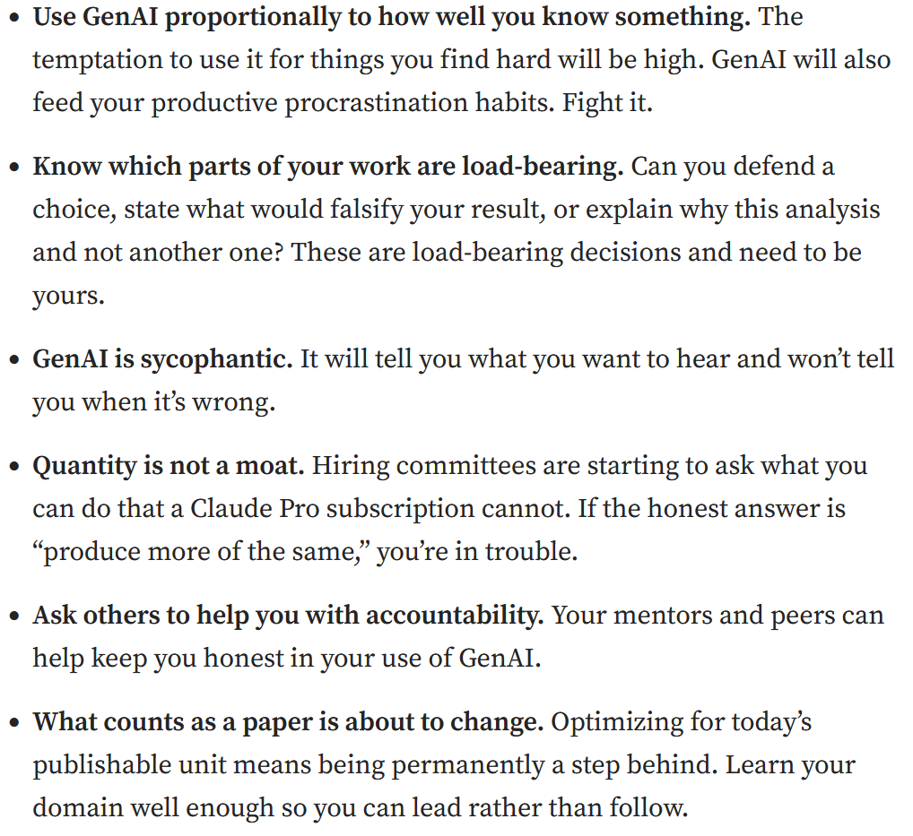

```{r setup}
#| include: false

library(countdown)

knitr::opts_chunk$set(
  fig.width = 8,
  fig.asp = 0.618,
  fig.retina = 3,
  dpi = 300,
  out.width = "80%",
  fig.align = "center"
)

options(scipen = 100)
```

# Today - Syllabus Time!

I hope you have one. If not, grab it [here](/files/PSYC640_Stats_Fall26.pdf).

------------------------------------------------------------------------

## When the Teaching Happens

**💾 Meeting Times:** Thursday's 9:30am - 12:20pm

**🧑‍🏫 Drop in Office Hours:** Tuesday's 10am - 12:00 pm

**📧 Best way to contact me?** Email me. I will usually respond within 24 hours. If it has been longer, then you can send me a follow-up

::: callout-note
I just figured out how to easily put emojis into the presentation. I'm sorry that you will have to witness that.
:::

## Communication

Please ask questions! 🙋‍♀️

If you are having trouble, just ask!!

Be open and honest with me and I will do what I can to support you.

## Who the heck am I? 🤷

- Undergraduate degree at University of Denver

  - Psychology & Philosophy

  - Hated Statistics

- Graduate degree at University of Illinois at Urbana-Champaign

  - Advisor: Dr. Benjamin Hankin 👨‍🔬

  - Clinical/Community PhD 🎓

- Pre-Doctoral Internship & Postdoc at Rochester Institute of Technology 🐯

## A little more about me

- **Pronouns**: he/him/his

- 2 amazing kids, 2 dogs (Dachshund and Shepherd Mix), 1 wife

- **Currently Reading**: The Shadows of the Gods 🤷, Dungeon Crawler Carl 🐱

- **Currently Listening**: The Lonely Island & Seth Meyers Podcast

- **Currently Watching**: Love on the Spectrum, Bluey, and Lizzie McGuire

## Teaching Philosophy

- I’m here for you and to support you however I can

- My job is to create a supportive, low-stakes environment where you can crash test ideas and develop new skills

- Your responsibility is to come to class prepared, ready to have fun, take some risks, and actively participate!

  - Ask questions, share relevant funny stories, seek clarification, question the status quo where applicable

- Science is a team sport & failures/mistakes will happen, but it is okay! That’s what science and discovery is!

# [Syllabus](../files/PSYC640_Stats_Fall26.pdf){target="_blank"} Time

And we have this [fancy website](https://dharaden.github.io/psyc640/) 💻

::: callout-caution
Dr. Haraden will be extra
:::

## Class Materials

I've pulled from a lot of different textbooks. Good thing is, they are all free!

- [*Regression and Other Stories*](https://avehtari.github.io/ROS-Examples/) (Gelman, Hill & Vehtari, 2024)

- [*Learning Statistics with R*](https://learningstatisticswithr.com/book/) (Navarro)

- [*R for Data Science (2e)*](https://r4ds.hadley.nz/) (Wickham, Çetinkaya-Rundel, & Grolemund, 2023)

- [*Modern Statistics with R (2e)*](https://www.modernstatisticswithr.com/) (Thullin, 2025)

- [*Statistical Thinking*](https://statsthinking21.github.io/statsthinking21-core-site/) (Poldrack, 2024)

## Evaluation & Grading

|                            |            |
|----------------------------|------------|
| **Component**              | **Weight** |
| Labs & In-Class Check-ins  | 35%        |
| Journal Entries            | 10%        |
| Participation & Engagement | 10%        |
| Midterm Project            | 20%        |
| Final Project              | 25%        |

------------------------------------------------------------------------

### Labs & In Class Checks (35%)

Each week, you will take what we worked on in class and apply it to a series of questions. There will also be various check-ins that I will have in the beginning of some classes so I can get a sense of how you are doing and if I need to revisit topics.

Labs will typically be done completely in R, and will require the submission of a .Rmd file, and sometimes the .html file.

Lowest score for labs will be dropped

::: callout-important
***Each lab will be due the Tuesday \@ 11:59pm before the next class***
:::

------------------------------------------------------------------------

### Journal Entries (10%)

Each week, you will submit a short, reflective journal entry (at least 200 words)

You can write about anything, but would like to at least have some be related to the course. Things like "What was the 'muddiest' point for you, and what question would you ask about it?".

They can also take the form of just a general reflection. I want to get to know you and your learning throughout this process.

The content of what you write has *no impact* on your grade. In addition, what you write will be kept confidential.

::: notes
The purpose of this “assignment” is to help facilitate communication between you and me. I have found other instructors using this and I would like to be able to develop supportive relationships with students, so I decided to implement this. Other instructors reported that they found that many students were more comfortable discussing questions and concerns in their journal assignments rather than through email.
:::

------------------------------------------------------------------------

### Participation & Engagement (10%)

Come to Class. Work with the material.

Basically I want you to be here, be present and try. This will be very low stakes and there will be plenty of mistakes by myself and others. Not necessarily a reflection of how much you talk in front of everyone. There are other ways to participate and engage.

------------------------------------------------------------------------

### Midterm Project (20%)

Examining a dataset that I provide

You will be given an initial research idea, but it will be up to you to formulate an appropriate research question

Clean & Visualize the data, then build an appropriate model to answer your question

This project assesses your mastery of the first half of the course and will be due November 1st \@ 11:59pm.

------------------------------------------------------------------------

### Final Project (25%)

Examine a dataset that you have (or from a list of things that I provide

This will be an expanded version of the midterm

Develop your own research question, conduct analysis from start to finish

📋Write up your work - Brief Abstract/methods, Data analytic plan & Results section

Give a "lightening talk" about your findings

------------------------------------------------------------------------

## Course Policies

- Late

- Accommodations

- Safety

- Academic Integrity

------------------------------------------------------------------------

### Late Policy

*“A Wizard is never late, nor are they early. They arrive precisely when they mean to.”* 🧙‍♂️

You aren't a wizard, Harry.

10% deduction for each day late. Not accepted after 5 days.

------------------------------------------------------------------------

### Accommodations

I want you to succeed in this course!

There are formal channels that you can go through to get structured accommodations, but I am always available to help however I can

If you do have formal accommodations, please reach out to me to see how you would like to have them applied to this course. I know you submit the formal request, but I want to make sure it works for you however we are implementing it

::: callout-tip
Office hours are a good way to get support. *Can't make office hours?* Send me an email!
:::

------------------------------------------------------------------------

### Safety

I want you to feel safe and supported both in and outside of the class

I can provide references to services and do all that I can to get you connected

------------------------------------------------------------------------

### Academic Integrity

You know we are talking about AI here 🤖

Use AI as a really nice TA who can help you when I'm not around! *But this TA sometimes gets things wrong, or codes in a different way*

I want you to learn and understand these things. If you are going to AI to solve your problems, then I am doing something wrong (or maybe you are...)

------------------------------------------------------------------------

### Academic Integrity 🤖

[{fig-align="center"}](https://eytanadar.medium.com/ai-native-phd-students-f9f6eebc1f91)

------------------------------------------------------------------------

### Academic Integrity

If you do use an AI as a supportive tool, you must:

- **Acknowledge** that it was used in a brief note at the end of the assignment (e.g., *“I used ChatGPT to help me make sense of the error message I was getting.”*) as well as being properly cited ([RIT Library Citation Infoguide](https://infoguides.rit.edu/c.php?g=1207799&p=10293622))

::: callout-important
If I suspect AI usage beyond "support" or for portions of an assignment, you will likely receive a 0, and we will have a meeting. Turning in AI work is considered plagiarism. You *may* have the opportunity to revise at the discretion of the instructor.
:::

------------------------------------------------------------------------

# Any Questions?? 🎃
