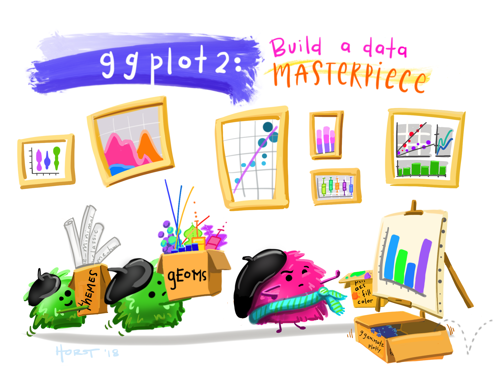
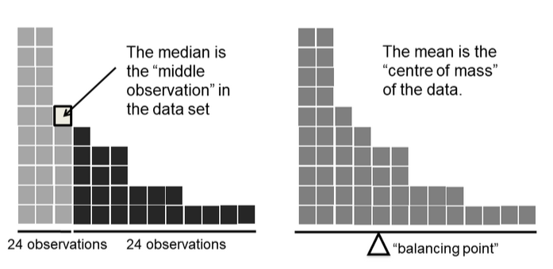
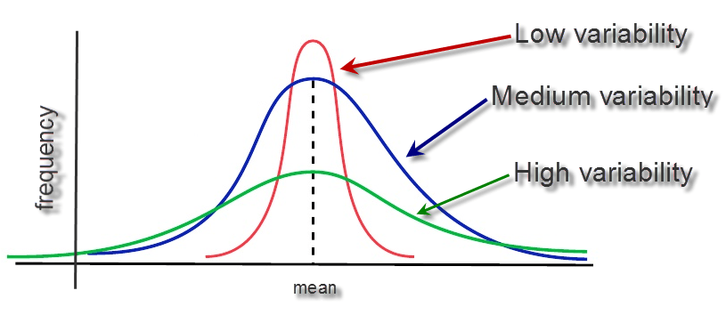
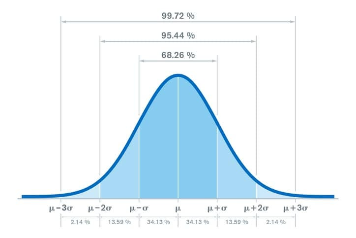
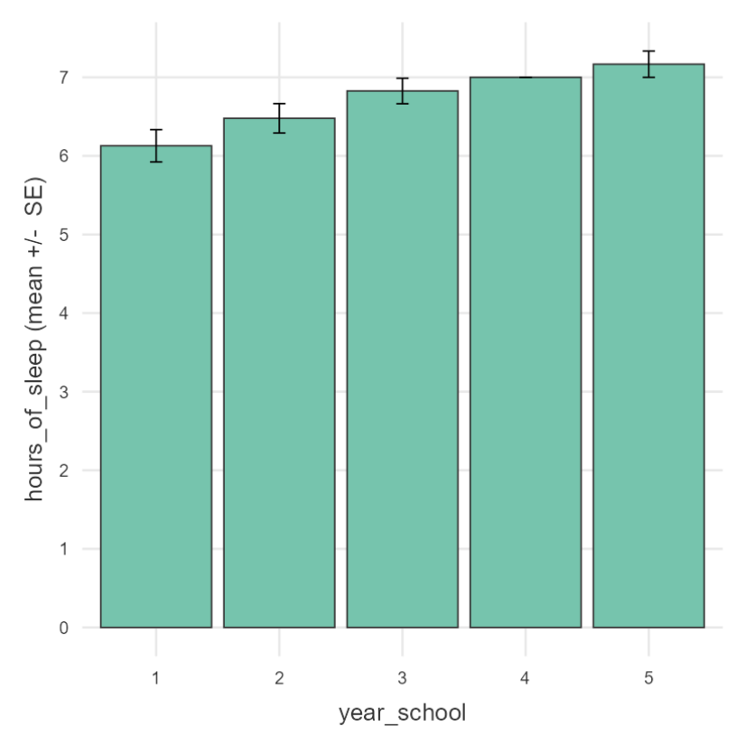
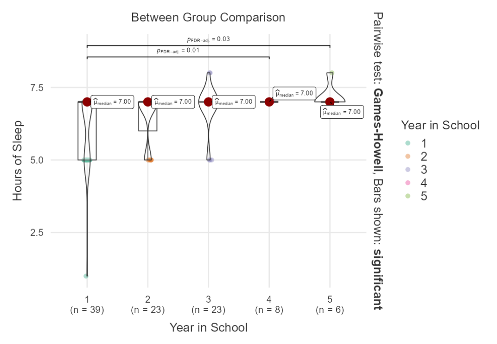
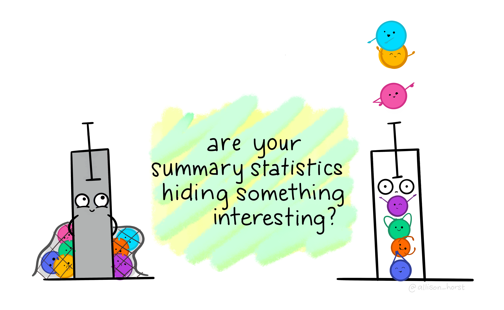

# Today

{fig-alt="A fuzzy monster in a beret and scarf, critiquing their own column graph on a canvas in front of them while other assistant monsters (also in berets) carry over boxes full of elements that can be used to customize a graph (like themes and geometric shapes). In the background is a wall with framed data visualizations. Stylized text reads “ggplot2: build a data masterpiece.” Learn more about ggplot2." fig-align="center"}

```{r results='hide'}
#| echo: true
#| message: false
#| warning: false
# File management
library(here)
# for dplyr, ggplot2
library(tidyverse)
#Loading data
library(rio)
# for descriptives
library(psych)

#Remove Scientific Notation 
options(scipen=999)
```

{fig-align="center"}

# Starting Up

JAMOVI is basically a GUI for R that is more point-click

Open JAMOVI and import the TIPI Data

> Menu \> Open \> tipi.csv

- We will use the TIPI data from the last lecture that has already been scored

Information on JAMOVI taken from [Stats Made Easy](https://www.statsmadeasy.com/home)

# Descriptive Statistics

------------------------------------------------------------------------

## Some Terminology

| Population | Sample |
|------------------------------------|------------------------------------|
| $\mu$ (mu) = Population Mean | $\bar{X}$ (x bar) = Sample Mean |
| $\sigma$ (sigma) = Population Standard Deviation | $s$ = $\hat{\sigma}$ = Sample Standard Deviation |
| $\sigma^2$ (sigma squared) = Population Variance | $s^2$ = $\hat{\sigma^2}$ = Sample Variance |

------------------------------------------------------------------------

## Measures of Central Tendency

For a given set of observations, measures of central tendency allow us to get the “gist” of the data.

They tell us about where the “average” or the “mid-point” of the data lies or how much deviation there is from a central point.

Let’s take a look at the data that we have already loaded in, and complete some of these tasks.

------------------------------------------------------------------------

### Mean/Average

$$\bar{X} = \frac{X_1+X_2+...+X\_{N-1}X_N}{N}
$$$$\bar{X} = \frac{X_1+X_2+...+X\_{N-1}X_N}{N}$$

OR

$$\bar{X} = \frac{1}{N}\sum_{i=1}^{N} X_i$$

------------------------------------------------------------------------

### Median

The median is the middle value of a set of observations: 50% of the data points fall below the median, and 50% fall above.

{fig-align="center"}

------------------------------------------------------------------------

## Measures of Variability

The overall spread of the data; How far from the middle?

{fig-align="center"}

------------------------------------------------------------------------

### Range

The range gives us the distance between the smallest and largest value in a dataset.

------------------------------------------------------------------------

### Variance and Standard Deviation

#### 68-95-99.7 Rule

For nearly normally distributed data:

- about 68% falls within 1 SD of the mean,

- about 95% falls within 2 SD of the mean,

- about 99.7% falls within 3 SD of the mean.

It is possible for observations to fall 4, 5, or more standard deviations away from the mean, but these occurrences are very rare if the data are nearly normal.

------------------------------------------------------------------------

{fig-align="center"}

------------------------------------------------------------------------

## Variance

The sum of squared deviations

$$\sigma^2 = \frac{1}{N}\sum_{i=1}^N(X-\bar{X})^2$$

$$\hat{\sigma}^2 = s^2 = \frac{1}{N-1}\sum_{i=1}^N(X-\bar{X})^2$$

------------------------------------------------------------------------

| $i$ (observation) | $X_i$ (value) | $\bar{X}$ (sample mean) | $X_i - \bar{X}$ (deviation from mean) | $(X_i - \bar{X})^2$ (squared deviation) |
|---------------|---------------|---------------|---------------|---------------|
| 1 | 56 | 36.6 | 19.4 | 376.36 |
| 2 | 31 | 36.6 | -5.6 | 31.36 |
| 3 | 56 | 36.6 | 19.4 | 376.36 |
| 4 | 8 | 36.6 | -28.6 | 817.96 |
| 5 | 32 | 36.6 | -4.6 | 21.16 |

------------------------------------------------------------------------

***Why do we use the squared deviation in the calculation of variance?***

::: incremental
- To get rid of negative values so that observations equally distant from the mean are weighted equally

- To weigh larger deviations from the mean
:::

------------------------------------------------------------------------

# Summarizing Data - JAMOVI

So far we have been examining various descriptive statistics. If you had followed along using R before, we were doing things individually. JAMOVI puts all descriptives in one location. We can then select which variable we want to get the summary stats for!

Let’s use it with our dataset!

Navigate to **Analyses \> Explore \> Descriptives**

Now, select your variable(s) and drag them in the empty Variables box.

If you want results broken down by another categorical variable, select it and drag this into the Split by box.

------------------------------------------------------------------------

## 

------------------------------------------------------------------------

## Select Descriptive Stats

Select how to display your data tables. You have got the following two options:

1.  Variables across columns

2.  Variables across rows

If your data is categorical select the **Frequency Table.**

A frequency table will be generated. Note, if you split your ordinal/nominal variable by another it will no longer display percentages (you can get this by using a [contingency table](https://www.statsmadeasy.com/jamovi-guides/basic-correlations/10-contigency-tables-chi-square-test-of-association))**.**

------------------------------------------------------------------------

### Select Descriptive Stats

You can now select the relevant descriptive statistics in the **Statistics** section

Select the variable you want to get descriptive statistics for and then select the test you want. Note, you can also split your variable by another ordinal or nominal variable, e.g. you might want to see the data split by Gender. 

**Important:** What descriptive statistics you select will depend on the type of data you have. If your data is categorical you should only select the option in Sample Size and the Mode under Central Tendency.

------------------------------------------------------------------------

## Select Descriptive Plots

To generate a basic descriptive plot navigate to the **Plot** section. 

The type of plot you generate will depend on the type of data you have. If your data is continuous you can select Histograms, Box Plots and Q-Q Plots. 

**Important:** For ordinal/nominal data you should only select a Bar Plot. The Bar Plot produced here is not great if you have long labels. 

More descriptive plots are available for all data types using the [surveymv](https://www.statsmadeasy.com/jamovi-guides/the-basics/6-descriptive-statistics-plots) and [JJStatsPlot](https://www.statsmadeasy.com/jamovi-guides/the-basics/6-descriptive-statistics-plots) modules

------------------------------------------------------------------------

## In-Class Activity 🧟

Calculate the variance associated with the prices and/or piece of LEGO sets.

1\) Go to the [LEGO website](https://www.lego.com/en-us/themes){target="_blank"} and select a Theme.

2\) Record the Price and Number of Pieces for 5 random sets within your theme on this [Google Sheet](https://docs.google.com/spreadsheets/d/1oxGD35Va66iDQvI2H_Sua_UZVEVp2SUya9wclPI6z9s/edit?usp=sharing){target="_blank"}

3\) Calculate the means and variance of each

------------------------------------------------------------------------

# 📈Plots in JAMOVI📉

------------------------------------------------------------------------

## JAMOVI Plotting

To get some more advanced forms of plotting, we will need to grab some additional modules. Modules in JAMOVI are like Packages in R. For more info on adding modules you can take a look [here](https://www.statsmadeasy.com/jamovi-guides/the-basics/2-add-modules).

The following modules will be explored in this section:

- `scatr`: This module allows you to create simple scatterplots. You can also include a regression line 

- `surveymv`: This module allows you to create a variety of plots using various types of data. It acts as a supplement to the pre-existing plots in JAMOVI

- `JJStatsPlot`: This module allows you to create a series of plots for all data types as well as displaying correlations and other statistics.

For a complete walkthrough, let's follow [Stats Made Easy](https://www.statsmadeasy.com/jamovi-guides/the-basics/7-plot-visualisations){target="_blank"}

------------------------------------------------------------------------

## Practice Plot

Make a bar plot that shows the average `hours_of_sleep` for students (on the y-axis) as a function of their `year_school` (on the x-axis). Add error bars. It should look like the plot below



::: callout-note
If this comes easy, try replicating the plot on the next page
:::

------------------------------------------------------------------------



------------------------------------------------------------------------

## Always Visualize Your Data!

{fig-align="center"}

# Now you try! 🎉

[Week 3 - InClass Activity](../class-activities/wk3_desc-viz.html){target="_blank"}
