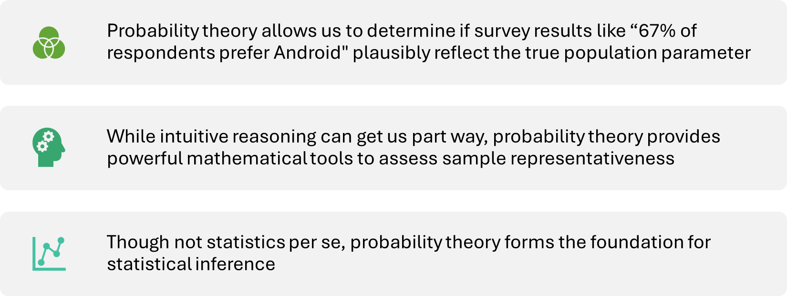

## From Squirrels to Significance: A Guide to Research Design & Inference

### Week 4

::: callout-warning
This lecture will be more theory and "lecture-y"
:::

------------------------------------------------------------------------

## The Core Challenge

- **Last week:** We learned to *describe* and *visualize* patterns in our **sample**.

- **The Rest of the Course:** We want to make claims about the **population**.

- **The Problem:** How do we know if a pattern we see in our sample (e.g., a difference between groups) is a **"real" effect** or just random **sampling error**?

- **The Solution:** We build a **statistical model** to test our question against the backdrop of randomness.

------------------------------------------------------------------------

## The Journey of a Research Question

- All research starts with a question about the world.

- But how do we get from a messy, real-world question to a clean, statistical answer?

**Our Journey Today:**

1.  **Part 1: From Concept to Data** (How do we measure what we care about?)

2.  **Part 2: The Blueprint for Claims** (How do we structure our study?)

3.  **Part 3: From Design to Model** (How do we analyze our data?)

# Part 1: From Concept to Data (Operationalization)

------------------------------------------------------------------------

## The First & Most Important Choice

- Before we can analyze anything, we need data. This means turning an abstract concept into a concrete, measurable variable.

- This process is called **operationalization**.

- Your operationalization is your argument for what a concept *means* in the context of your study.

------------------------------------------------------------------------

## The Squirrel Gang

Let's imagine a new study. Our research question is:

***Does being aggressively attacked by a campus squirrel for your sandwich increase a student's acute stress?***

- **Predictor:** `squirrel_incident` (Attacked vs. Not Attacked).

- **Outcome:** `acute_stress`.

But what *is* "acute stress"? As the researcher, how do you measure it?

::: {.callout-note appearance="minimal" icon="false"}
Turn to the person/people next to you and identify how you would define and measure "stress".
:::

------------------------------------------------------------------------

## How Would You Measure "Stress"?

|  |  |  |  |
|------------------|------------------|------------------|------------------|
| **Method of Measurement** | **How It Works** | **Data Generated** | **What It Really Measures** |
| **Subjective Self-Report** | "On a scale of 0-100, how stressed do you feel *right now*?" | **Continuous** (0-100) | The **feeling** of stress. |
| **Autonomic Arousal** | Measure heart rate in beats per minute (BPM). | **Continuous** (e.g., 115 BPM) | The **body's alarm** for stress. |
| **Cognitive Impairment** | "Count backward from 1,084 by 7s." Measure speed & accuracy. | **Continuous** (# of errors) | The **brain's processing** under stress. |
| **Coded Facial Expression** | Analyze video for micro-expressions of fear or anger. | **Categorical** or **Ordinal** | The **face's expression** of stress. |

# Part 2: The Blueprint for Claims (Study Design)

------------------------------------------------------------------------

## The Two Big Claims

Now that we know *what* we're measuring, let's talk about *how* we structure the study. Your design determines the kind of claim you can make.

1.  **An Associational Claim:** Two variables are related.

    - *"People who experience squirrel attacks tend to report higher stress."*

2.  **A Causal Claim:** A change in one variable *causes* a change in another.

    - *"The experience of a squirrel attack causes an increase in stress."*

------------------------------------------------------------------------

## The 3 Rules of Causality

To earn the right to say "X causes Y," you must demonstrate three things:

1.  **Covariance:** X and Y are related.

2.  **Temporal Precedence:** The cause (X) must happen *before* the effect (Y).

3.  **Internal Validity:** There are no other plausible explanations (we've ruled out **confounds**).

------------------------------------------------------------------------

## The Confounding Variable Problem

A **confound** is a "third variable" that creates a spurious relationship between your two variables. This is the #1 threat to causal claims.

- **Classic Example:** Ice cream sales are positively correlated with drowning deaths.

- **The Confound:** Summer heat! Hot weather causes both more ice cream sales and more swimming.

------------------------------------------------------------------------

## The Gold Standard for Defeating Confounds: The Experiment

A **True Experiment** is the most powerful tool for establishing causality. It has two magic ingredients:

1.  **Manipulation:** The researcher actively manipulates the Independent Variable (IV).

2.  **Random Assignment:** Every participant has an equal chance of being in any condition. This breaks the links to potential confounds by distributing them evenly across groups.

------------------------------------------------------------------------

## Key Design Dimensions

- **Between-Subjects:** Different groups of people get different conditions. We compare Group A vs. Group B.

- **Within-Subjects:** The same group of people experiences all conditions. We compare people to themselves.

- **Cross-Sectional:** All data is collected at a single point in time. (Fails temporal precedence).

- **Longitudinal:** Data is collected from the same people over multiple time points. (Establishes temporal precedence).

------------------------------------------------------------------------

#### **A New Dimension - Who Are You Studying?**

- So far, we've focused on what we *do* with our participants (the design).

- But there's another crucial question: *Who are our participants and who do they represent?*

- **Population:** The entire group we want to draw conclusions about.

  - *e.g., All college students in the United States.*

- **Sample:** The specific subset of the population that we actually collect data from.

  - *e.g., 150 undergraduates from our university's psychology subject pool.*

- The central question of sampling is **generalizability**: How well do the findings from our sample apply to the broader population?

------------------------------------------------------------------------

#### **The Key Distinction in Sampling**

**Random Sampling (The Ideal)**

- Every single member of the target population has an equal chance of being selected for the study.

- **Why it's the gold standard:** It minimizes systematic bias. In the long run, it produces samples that are highly representative of the population.

**Convenience Sampling (The Reality)**

- The researcher includes people who are easy to reach (e.g., Using undergraduate students, posting a flier in the clinic, etc.)

- **The Limitation:** Our convenience sample may differ from the population in systematic ways (e.g., younger, wealthier, college educated, etc.). Must be thoughtful when generalizing from these samples.

## 🛠️ Activity Stop 1: Design Warm-Up

**The Inference Machine:** Part 0 · 5 min · Pairs · No code

> *"Grad students who work more than 50 hours a week are more burned out, so universities should cap lab hours."*

1.  Predictor & outcome: how would you **operationalize** each?
2.  **Association** or **causal** claim? What does the headline *imply*?
3.  Which of the **3 rules of causality** can a survey satisfy?
4.  Name one **confounding variable**.
5.  Design an **experiment** to test it (or explain why you can't).

[Open the activity](../class-activities/wk4_inference-machine.html){.button target="_blank"}

# Checkpoint

We have our perfectly designed study to collect stress data from our observations on being on the squirrel hunt (let's ignore the ethics around knowing squirrels might attack and not interfering).

We've moved beyond just *describing* our sample with means and standard deviations.

Now we have to make an **inference**. We see a difference in stress between the groups... but how do we know if it's "real" or just random chance?

To answer this, we need to understand the logic of randomness itself. We need to understand **probability**.

------------------------------------------------------------------------

## Descriptives vs. Inference

::::: columns
::: {.column width="50%"}
Moving from simply describing our data

*With means and standard deviations*
:::

::: {.column width="50%"}
To drawing conclusions about the population

*Using inferential statistics*
:::
:::::

------------------------------------------------------------------------

## Probability - Understanding Randomness

There are several possible interpretations of probability but they (almost) completely agree on the mathematical rules probability must follow:

$P(A)$ = Probablity of event A

0 ≤ $P(A)$ ≤ 1

------------------------------------------------------------------------

## The Law of Large Numbers

As more observations are collected, the proportion of occurrences with a particular outcome, $p̂_n$, converges to the probability of that outcome, $p$.

*Example:*

- As the sample size increases, the sample mean tends to get closer to the population mean

- And as the sample size approaches infinity ♾️, the sample mean approaches the population mean

<https://psu-eberly.shinyapps.io/Law_of_Large_Numbers/>

------------------------------------------------------------------------

### Law of Large Numbers

> *When tossing a fair coin, if heads comes up on each of the first 10 tosses, what do you think the chance is that another head will come up on the next toss? 0.5, less than 0.5, or more than 0.5?*

|                                     |
|-------------------------------------|
| H H H H H H H H H H [?]{.underline} |

------------------------------------------------------------------------

### Law of Large Numbers

> *When tossing a fair coin, if heads comes up on each of the first 10 tosses, what do you think the chance is that another head will come up on the next toss? 0.5, less than 0.5, or more than 0.5?*

|                                     |
|-------------------------------------|
| H H H H H H H H H H [?]{.underline} |

- Probability is still 0.5

- Coin is not "due" for a tail

::: callout-important
The common misunderstanding of the LLN is that random processes are supposed to compensate for whatever happened in the past; this is just not true and is also called gambler’s fallacy (or law of averages)
:::

------------------------------------------------------------------------

## 🎲 See It: Sampling Distributions

Before we code it, let's *watch* it happen.

1.  **Draw 1 sample slowly:** one sample becomes one point in the bottom chart
2.  **Draw 10,000:** the pile of sample means is the **sampling distribution**
3.  **Change n** (10 → 100): the dashed outline shows the old width. What happens to the spread? (**Law of Large Numbers**)
4.  **Switch the population to *Skewed* or *Bimodal***: what shape do the *sample means* take? (**Central Limit Theorem**)

[Open the interactive](../interactives/sampling-distribution.html){.button target="_blank"}

------------------------------------------------------------------------

## 🛠️ Activity Stop 2: Seeing the Law of Large Numbers

::: callout-tip
**The Inference Machine: Parts 1–2** · 15 min · Pairs
:::

1.  Download the activity file and run the `setup` chunk
2.  **Build a population** of 10,000 grad students (we know the *true* mean!)
3.  Draw **one** sample of 10. Compare your mean with your neighbor's
4.  Draw **1,000** samples each at n = 10, 50, 200 and plot them

**Watch for:** What happens to the *center* and the *spread* as n grows?

[Open the activity](../class-activities/wk4_inference-machine.html){.button target="_blank"} <a href="../files/_lab-qmd/wk4_inference-machine_inclass.qmd" download="wk4_inference-machine_inclass.qmd" class="button">Download .qmd</a>

------------------------------------------------------------------------

## Statistics, Probability & Inference

- Think about seeing statistics posted on the news

  - Often times polling companies survey a large sample to then make a statement about the population

- We assume the sample is representative of the larger population, but how representative?

  - This is where probability theory comes in

- Probability theory provides tools to assess how likely sample results are if they differ from the true population parameter

------------------------------------------------------------------------

## Role of Probability Theory

------------------------------------------------------------------------

## Probability - The 2 main realms

::::: columns
::: {.column width="50%"}
### Frequentist

Probability is a **long-run frequency** of an event
:::

::: {.column width="50%"}
### Bayesian

Probability of an event as the **degree of belief**
:::
:::::

------------------------------------------------------------------------

### Frequentist Approach

[**Pros**]{.underline}

- **Objective**: the probability of an event is grounded in the world & exist in the physical universe
- **Unambiguous**: two people can watch the same sequence of events and will come up with the same answer

------------------------------------------------------------------------

### Frequentist Approach

[**Cons**]{.underline}

- ♾️Infinity: not possible in the physical world

  - What would happen if we flipped a coin an infinite amount of times?

- Narrow in scope: although we want to make statements about a single event, we typically are forbidden (see above point about infinity)

  - Example: There is a 60% chance that it will rain on Wednesday in Rochester. “There is a category of days for which I predict a 60% chance of rain, and if we look only across those days for which I make this prediction, then on 60% of those days it will actually rain”

# Probability Theory as part of the solution

**So, How Does This Help Us?**

The Frequentist approach gives us a powerful framework: We can test our research hypothesis by asking, "How surprising would our sample data be if there were truly no effect in the long run?"

This question is the foundation for the rest of our journey today.

# Part 3: From Design to Model (The Decision Tree)

------------------------------------------------------------------------

## The Universal Language of Models

- Your measurement and design choices create the blueprint for your analysis. They lead you directly to the correct statistical model.

- All models we learn this semester can be expressed in R with a simple formula:

`Outcome ~ Predictor`

------------------------------------------------------------------------

## A Decision Tree for Your Model 🌳

::::: columns
::: {.column width="50%"}
**If your goal is to... COMPARE GROUPS:**

- Predictor (IV) is **Categorical**

- Outcome (DV) is **Continuous**

- 👉 You are in the **t-test / ANOVA** family of models.

- The model looks like: `Continuous_Outcome ~ Categorical_Predictor`
:::

::: {.column width="50%"}
**If your goal is to... ASSESS AN ASSOCIATION:**

- Predictor (IV) is **Continuous**

- Outcome (DV) is **Continuous**

- 👉 You are in the **Correlation / Regression** family of models.

- The model looks like: `Continuous_Outcome ~ Continuous_Predictor`
:::
:::::

------------------------------------------------------------------------

## Data to Models to Inference (NHST)

So we have a model, like: `depression_score ~ therapy_group`. How do we test it?

We use the Null Hypothesis Significance Testing (NHST) framework:

- **The Null Hypothesis** $H_0$ : A statement that the predictor has **no relationship** with the outcome in the population. It is the "null model."

  - $H_0$ : In the population, there is no difference in depression scores between the therapy and control groups. `therapy_group` does **not** predict `depression_score`.

- **The Alternative Hypothesis** $H_A$ : Our research hypothesis. The predictor **does** have a relationship with the outcome.

  - $H_A$ : In the population, there **is** a difference. `therapy_group` **does** predict `depression_score`.

------------------------------------------------------------------------

## The p-value

The **p-value** tells us how surprising our sample data would be *if the null hypothesis (the "no relationship" model) were true for the population.*

It's a measure of the incompatibility between our data and the null model.

- A **small p-value** (p\<.05) suggests that our data are incompatible with the null model. We have evidence to **reject the null model** and conclude that our predictor is likely related to the outcome.

The statistical test you run (`t.test`, `cor.test`, `lm`) is just the engine that calculates the p-value for your specific model. The logic is always the same.

## 🛠️ Activity Stop 3: Putting p-values to the Test

::: callout-tip
**The Inference Machine: Parts 3–4** · \~18 min · Pairs
:::

**Part 3: The Null World:** two groups from the *same* population, 1,000 times

- How often is p \< .05 when *nothing* is going on?

**Part 4: A Real Effect:** group 2 is truly 5 points higher

- How often do we *detect* it with n = 20, 50, 100 per group?

**Finished early?** Try the *Forking Paths* challenge 🍴

[Open the activity](../class-activities/wk4_inference-machine.html){.button target="_blank"}

------------------------------------------------------------------------

# Synthesis

- Your **Statistical Model** (and its p-value) tells you if a relationship is **statistically significant** (i.e., unlikely to be due to random chance).

But...

- Your **Study Design** tells you if you can call that relationship **causal** (requires random assignment, temporal precedence).

- Your **Sampling Method** tells you if you can **generalize** that relationship to a broader population.

::: callout-important
### A p-value or statistical test cannot fix a flawed design!
:::

------------------------------------------------------------------------

## ✍️ Wrap-Up: The Inference Machine

With your partner, finish this sentence:

> *"A p-value tells me \_\_\_\_\_\_\_, but it does **not** tell me \_\_\_\_\_\_\_."*

Add it to the end of your activity file.

------------------------------------------------------------------------

## ☕ Break {background-color="#C9ADE0"}

**10 minutes**

When we come back: **Data Detectives** 🔍

------------------------------------------------------------------------

## 🛠️ Activity Stop 4: Data Detectives

::: callout-tip
**Week 4 Exercises** · \~50 min
:::

**Follow along (\~20 min):** Graduate school burnout data

**On your own (\~30 min):** Child well-being data

- **Task 1:** Parenting style → anxiety
- **Task 2:** Sleep → anxiety *(finish as homework if we run short on time)*
- 🤔 **Challenge:** Can we call it *causal*?

[Open Week 4 Exercises](../class-activities/wk4_beg-inf.html){.button target="_blank"}
