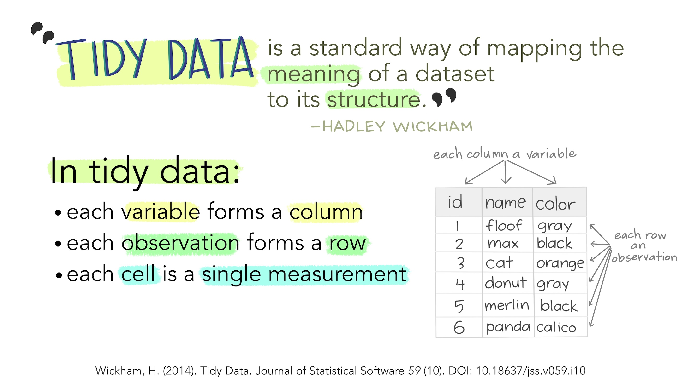
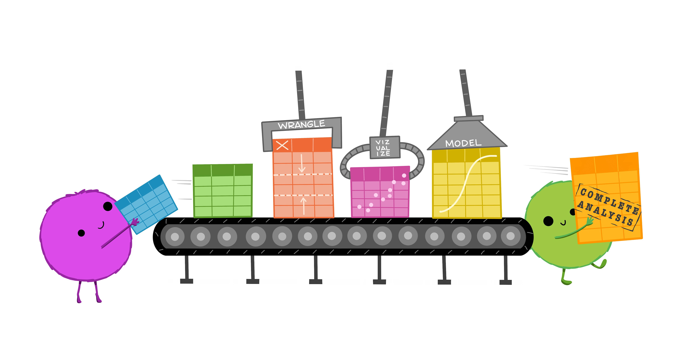

# Foundations of R

You survived the first week! I hope your classes are off to a good start. I'm looking forward to getting to meet you all in person this week.

This session we are going to set up our foundation for using R. One of the most helpful things is the R Project. Having a project file will help us when we read in data, which is often one of the hardest parts to start with. We will import some new data, and compute some new values. This will be a skill that will be useful no matter what data you are working with. There will be plenty of practice with this!

{fig-alt="Stylized text providing an overview of Tidy Data. The top reads “Tidy data is a standard way of mapping the meaning of a dataset to its structure. - Hadley Wickham.” On the left reads “In tidy data: each variable forms a column; each observation forms a row; each cell is a single measurement.” There is an example table on the lower right with columns ‘id’, ‘name’ and ‘color’ with observations for different cats, illustrating tidy data structure." fig-align="center"}

{fig-alt="There are two sets of anthropomorphized data tables. The top group of three tables are all rectangular and smiling, with a shared speech bubble reading “our columns are variables and our rows are observations!”. Text to the left of that group reads “The standard structure of tidy data means that “tidy datasets are all alike…” The lower group of four tables are all different shapes, look ragged and concerned, and have different speech bubbles reading (from left to right) “my column are values and my rows are variables”, “I have variables in columns AND in rows”, “I have multiple variables in a single column”, and “I don’t even KNOW what my deal is.” Next to the frazzled data tables is text “...but every messy dataset is messy in its own way. -Hadley Wickham.”" fig-align="center"}

{fig-alt="On the left is a happy cute fuzzy monster holding a rectangular data frame with a tool that fits the data frame shape. On the workbench behind the monster are other data frames of similar rectangular shape, and neatly arranged tools that also look like they would fit those data frames. The workbench looks uncluttered and tidy. The text above the tidy workbench reads “When working with tidy data, we can use the same tools in similar ways for different datasets…” On the right is a cute monster looking very frustrated, using duct tape and other tools to haphazardly tie data tables together, each in a different way. The monster is in front of a messy, cluttered workbench. The text above the frustrated monster reads “...but working with untidy data often means reinventing the wheel with one-time approaches that are hard to iterate or reuse.”" fig-align="center"}

{fig-alt="Cute fuzzy monsters putting rectangular data tables onto a conveyor belt. Along the conveyor belt line are different automated “stations” that update the data, reading “WRANGLE”, “VISUALIZE”, and “MODEL”. A monster at the end of the conveyor belt is carrying away a table that reads “Complete analysis.”" fig-align="center"}

"Illustrations from the [Openscapes](https://www.openscapes.org/) blog [Tidy Data for reproducibility, efficiency, and collaboration](https://www.openscapes.org/blog/2020/10/12/tidy-data/) by Julia Lowndes and Allison Horst"

## Slides

💻R Foundations <a href="/slides/lec-03_foundations.pptx" download="wk2_foundations_slides.pptx">R Foundation Slides (.pptx)</a>

[💻 Data Wrangling](../slides/lec-3_wrangle.html){target="_blank"}

## Data

📈Cookie Ratings <a href="/files/data/cookie_ratings.csv" download="cookie_ratings.csv">Cookie Ratings (.csv)</a>

📈TIPI Data <a href="/files/data/TIPI_Data.csv" download="TIPI_Data.csv">TIPI Data (.csv)</a>

## Activity

🍪 The R Kitchen <a href="/files/handouts/welcome-to-the-kitchen.docx" download="welcome-to-the-kitchen.docx">Welcome to the Kitchen (.docx)</a>

[📓Tidy Data with R](../class-activities/wk2_tidy-intro.html)

## For Next Time

📋[Lab 3 - Getting Comfy with Data Wrangling](../labs/lab-03_data-wrangling.html)

📖Read [Chapter 5 - LSR](https://learningstatisticswithr.com/book/){target="_blank"}

📖Read [Chapter 1 & 3 - R4DS](https://r4ds.hadley.nz/){target="_blank"}

  

::: {style="font-size: 0.875em;"}
Back to [course schedule](/ "Course schedule") ⏎
:::
